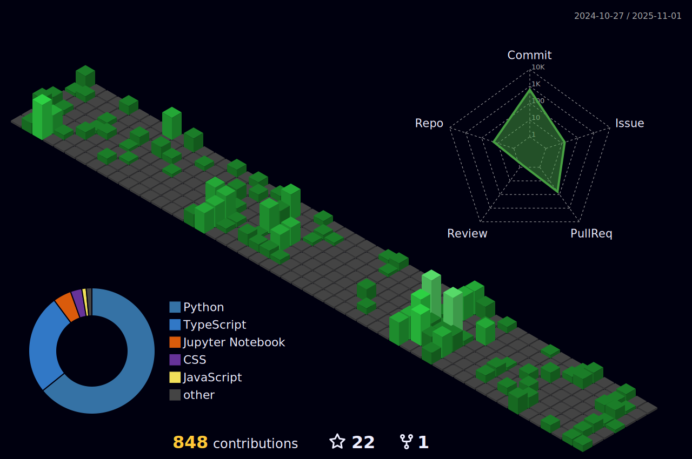

## Eunsung Shin, Software Engineer
- 🏠[Blog](https://watanka.github.io)   
- ✒️[LinkedIn](https://www.linkedin.com/in/eun-sung-shin-6b2386223/)  
- 📫 email : eunsung.shin@gmail.com  
---
#### Certificates
- Certified Kubernetes Administrator (24.09)
- SQL Developer (24.08)
- AWS Cloud Practitoner (24.06)
- 빅데이터 분석기사 (22.12)
---

<h3 align="left">Languages and Tools:</h3>

           

